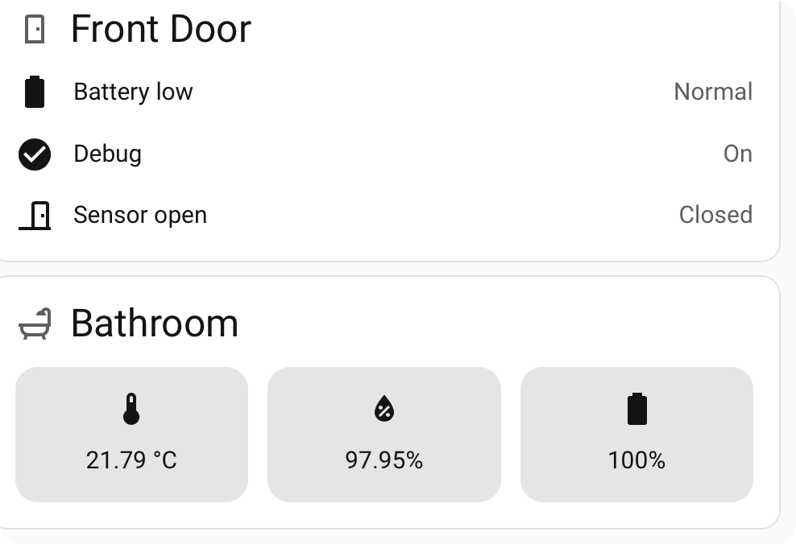
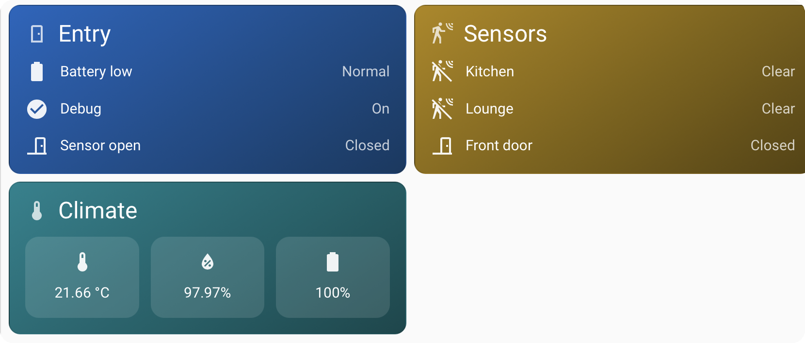

# Entity Group Card

A clean, GUI-driven Lovelace card that groups a device's entities — or any
hand-picked list of entities — into a single tidy card. Built to sit alongside
the rest of the [mycrouch card collection](#the-mycrouch-card-collection): same
visual DNA, theme-native by default, no build step.



## Features

- **Two entity sources.** Pick a **device** and its entities are auto-resolved
  via the entity registry (rename-safe — it follows `device_id`, not entity-ID
  naming), or hand-pick **individual entities** from anywhere.
- **Two layouts.** A labelled **row list** (icon · name · value) or a compact
  **chip grid** (icon + value) that wraps responsively — matching the two
  grouping styles used across the rest of the dashboard.
- **State-aware icons.** Uses Home Assistant's own `<ha-state-icon>`, so a door
  shows open/closed, a battery shows its level, and everything follows your
  theme's icon colours automatically.
- **Three background styles.** `default` (fully theme-native), `theme` (apply
  *any installed theme* to just this card), or `manual` (a custom gradient with
  a light/dark text toggle).
- **Sensible state text.** Binary sensors read as *Open/Closed*, *Detected/Clear*,
  *Normal/Low* etc. by `device_class`; sensors show their unit; tap any item to
  open the native more-info dialog.
- **Full GUI editor** with live preview — no YAML required.

### Backgrounds

Default follows your active theme. `theme` mode gives every card its own theme
picker — perfect with [gradient-themes](https://github.com/mycrouch/gradient-themes) —
and `manual` mode takes any two-colour gradient.



## Installation

### HACS (custom repository)

1. HACS → three-dot menu → **Custom repositories**.
2. Add `https://github.com/mycrouch/entity-group-card`, category **Dashboard**.
3. Install **Entity Group Card**, then hard-refresh the browser.

### Manual

Copy `entity-group-card.js` to `/config/www/` and add a dashboard resource:

```yaml
url: /local/entity-group-card.js
type: module
```

## Configuration

Add the card from the picker ("Entity Group Card") and use the visual editor —
every option below is exposed there. YAML is fully supported too:

```yaml
# Device mode — auto-pull a device's entities as a chip grid
type: custom:entity-group-card
title: Kitchen
icon: mdi:countertop
source: device
device: 1a2b3c...          # device_id (the editor picks this for you)
layout: grid
columns: 3
style: default

# Manual mode — hand-picked entities as a row list on a custom gradient
type: custom:entity-group-card
title: Front Door
source: entities
entities:
  - binary_sensor.front_door_contact
  - sensor.front_door_battery
  - entity: binary_sensor.front_door_debug   # per-item override form
    name: Debug
    icon: mdi:bug
layout: rows
style: manual
background_start: "#1565c0"
background_end: "#0d2b45"
```

### Options

| Option | Type | Default | Description |
| --- | --- | --- | --- |
| `title` | string | – | Header title. Omit and set `show_header: false` for a bare card. |
| `icon` | string | – | Optional header icon (any `mdi:` name). |
| `source` | `entities` \| `device` | `entities` | Where the entities come from. |
| `device` | string | – | Device ID (device mode). Entities auto-resolved from the registry. |
| `show_advanced` | boolean | `false` | Include config/diagnostic entities in device mode. |
| `entities` | list | `[]` | Entity IDs, or `{entity, name, icon, hide}` objects for overrides. |
| `layout` | `rows` \| `grid` | `rows` | Row list or chip grid. |
| `columns` | number | auto | Fixed column count for grid mode (otherwise responsive). |
| `style` | `default` \| `theme` \| `manual` | `default` | Background style. |
| `theme` | string | – | Installed theme name (theme mode). |
| `background_start` | hex | `#1565c0` | Gradient start (manual mode). |
| `background_end` | hex | `#0d2b45` | Gradient end (manual mode). |
| `dark_text` | boolean | `false` | Use dark text for light gradients. |
| `show_header` | boolean | `true` | Show/hide the header row. |

Per-entity overrides (`name`, `icon`, `hide`) live in the card config and never
touch the entity registry, so renaming here is local to this card.

## The mycrouch card collection

These Home Assistant Lovelace cards share a common design language — a clean
**default** look that inherits your active theme, plus a per-card **theme**
picker — so they sit together neatly on one dashboard. Pair any of them with
**gradient-themes** for 40 ready-made gradient and pastel backgrounds.

| Card | What it is |
| --- | --- |
| **Entity Group Card** (this card) | Group any device's entities as a row list or chip grid |
| [pro-v-weather-card](https://github.com/mycrouch/pro-v-weather-card) | Weather-station console — clock, moon, forecast, UV, solar, wind |
| [weather-station-card](https://github.com/mycrouch/weather-station-card) | LCD-console weather station with backlight themes |
| [airtouch-card](https://github.com/mycrouch/airtouch-card) | AirTouch 4/5 AC + zone control |
| [sensibo-thermostat-card](https://github.com/mycrouch/sensibo-thermostat-card) | Sensibo thermostat with mode-coloured backgrounds |
| [ecovacs-vacuum-card](https://github.com/mycrouch/ecovacs-vacuum-card) | Ecovacs/Deebot vacuum with area cleaning |
| [gradient-themes](https://github.com/mycrouch/gradient-themes) | 40 gradient + pastel dashboard themes |

## License

MIT © Jason Crouch. Icons rendered via Home Assistant's built-in Material Design
Icons (© Pictogrammers, Apache 2.0); no icon assets are bundled.
